# Tables
- [GenTable](#gentable)
- [GenTableColumn](#gentablecolumn)
- [SysConfig](#sysconfig)
- [SysDept](#sysdept)
- [SysDictData](#sysdictdata)
- [SysDictType](#sysdicttype)
- [SysLogininfor](#syslogininfor)
- [SysMenu](#sysmenu)
- [SysNotice](#sysnotice)
- [SysPost](#syspost)
- [SysUserPost](#sysuserpost)
- [SysRoleDept](#sysroledept)
- [SysRoleMenu](#sysrolemenu)
- [SysUser](#sysuser)
- [SysRole](#sysrole)
- [SysUserRole](#sysuserrole)
- [collection](#collection)
- [init_mobile](#init_mobile)
- [platform_token](#platform_token)
- [publisher](#publisher)
- [ticket](#ticket)
- [tr_order](#tr_order)
- [tr_pay_notification](#tr_pay_notification)
- [tr_transfer](#tr_transfer)
- [user](#user)
- [declarex](#declarex)
- [recommend_img](#recommend_img)
- [resource](#resource)
- [collection_day_count](#collection_day_count)
  - The underlying view does not contain a valid unique identifier and can therefore currently not be handled by Prisma Client.
- [collection_day_ticket_count](#collection_day_ticket_count)
  - The underlying view does not contain a valid unique identifier and can therefore currently not be handled by Prisma Client.
This view or at least one of its fields has comments in the database, and requires an additional setup for migrations: Read more: https://pris.ly/d/database-comments
- [user_day_count](#user_day_count)
  - The underlying view does not contain a valid unique identifier and can therefore currently not be handled by Prisma Client.
- [user_month_count](#user_month_count)
  - The underlying view does not contain a valid unique identifier and can therefore currently not be handled by Prisma Client.
- [user_week_count](#user_week_count)
  - The underlying view does not contain a valid unique identifier and can therefore currently not be handled by Prisma Client.
- [transfer_day_count](#transfer_day_count)
  - The underlying view does not contain a valid unique identifier and can therefore currently not be handled by Prisma Client.
- [transfer_day_ticket_count](#transfer_day_ticket_count)
  - The underlying view does not contain a valid unique identifier and can therefore currently not be handled by Prisma Client.
This view or at least one of its fields has comments in the database, and requires an additional setup for migrations: Read more: https://pris.ly/d/database-comments

# ER diagram
```plantuml
@startuml erd
skinparam linetype ortho
entity "GenTable" as GenTable {
+ tableId [PK] : Int 
--
  tableName : String
  tableComment : String
  subTableName : String
  subTableFkName : String
  className : String
  tplCategory : String
  tplWebType : String
  packageName : String
  moduleName : String
  businessName : String
  functionName : String
  functionAuthor : String
  genType : String
  genPath : String
  options : String
  createBy : String
  createTime : String
  updateBy : String
  updateTime : String
  remark : String
}

entity "GenTableColumn" as GenTableColumn {
+ columnId [PK] : Int 
--
  # tableId : [FK] GenTable
  columnName : String
  columnComment : String
  columnType : String
  javaType : String
  javaField : String
  isPk : String
  isIncrement : String
  isRequired : String
  isInsert : String
  isEdit : String
  isList : String
  isQuery : String
  queryType : String
  htmlType : String
  dictType : String
  sort : Int
  createBy : String
  createTime : String
  updateBy : String
  updateTime : String
}

entity "SysConfig" as SysConfig {
+ configId [PK] : Int 
--
  configName : String
  configKey : String
  configValue : String
  configType : String
  createBy : String
  createTime : String
  updateBy : String
  updateTime : String
  remark : String
}

entity "SysDept" as SysDept {
+ deptId [PK] : Int 
--
  parentId : Int
  ancestors : String
  deptName : String
  orderNum : Int
  leader : String
  phone : String
  email : String
  status : String
  createBy : String
  createTime : String
  updateBy : String
  updateTime : String
}

entity "SysDictData" as SysDictData {
+ dictCode [PK] : Int 
--
  dictSort : Int
  dictLabel : String
  dictValue : String
  # dictType : [FK] SysDictType
  cssClass : String
  listClass : String
  isDefault : String
  status : String
  createBy : String
  createTime : String
  updateBy : String
  updateTime : String
  remark : String
}

entity "SysDictType" as SysDictType {
+ dictId [PK] : Int 
--
  dictName : String
  dictType : [UK] String
  status : String
  createBy : String
  createTime : String
  updateBy : String
  updateTime : String
  remark : String
}

entity "SysLogininfor" as SysLogininfor {
+ infoId [PK] : Int 
--
  userName : String
  ipaddr : String
  loginLocation : String
  browser : String
  os : String
  status : String
  msg : String
  loginTime : String
}

entity "SysMenu" as SysMenu {
+ menuId [PK] : Int 
--
  * menuName : String
  parentId : Int
  orderNum : Int
  path : String
  component : String
  query : String
  isFrame : Int
  isCache : Int
  menuType : String
  visible : String
  status : String
  perms : String
  icon : String
  createBy : String
  createTime : String
  updateBy : String
  updateTime : String
  remark : String
}

entity "SysNotice" as SysNotice {
+ noticeId [PK] : Int 
--
  * noticeTitle : String
  * noticeType : String
  noticeContent : String
  status : String
  createBy : String
  createTime : String
  updateBy : String
  updateTime : String
  remark : String
}

entity "SysPost" as SysPost {
+ postId [PK] : Int 
--
  * postCode : String
  * postName : String
  * postSort : Int
  * status : String
  createBy : String
  createTime : String
  updateBy : String
  updateTime : String
  remark : String
}

entity "SysUserPost" as SysUserPost {
--
  # userId : [FK] SysUser
  # postId : [FK] SysPost
}

entity "SysRoleDept" as SysRoleDept {
--
  # roleId : [FK] SysRole
  # deptId : [FK] SysDept
}

entity "SysRoleMenu" as SysRoleMenu {
--
  # roleId : [FK] SysRole
  # menuId : [FK] SysMenu
}

entity "SysUser" as SysUser {
+ userId [PK] : Int 
--
  # deptId : [FK] SysDept
  * userName : String
  * nickName : String
  userType : String
  email : String
  phonenumber : String
  sex : String
  avatar : String
  password : String
  status : String
  loginIp : String
  loginDate : String
  createBy : String
  createTime : String
  updateBy : String
  updateTime : String
  remark : String
}

entity "SysRole" as SysRole {
+ roleId [PK] : Int 
--
  * roleName : String
  * roleKey : String
  * roleSort : Int
  dataScope : String
  menuCheckStrictly : Int
  deptCheckStrictly : Int
  * status : String
  createBy : String
  createTime : String
  updateBy : String
  updateTime : String
  remark : String
}

entity "SysUserRole" as SysUserRole {
--
  # userId : [FK] SysUser
  # roleId : [FK] SysRole
}

entity "collection" as collection {
+ id [PK] : Int 
--
  collection_name : String
  # ticket_id : [FK] ticket
  * ticket_type : Int
  chain_type : Int
  * casting_uid : Int
  casting_name : String
  daop_casting_id : Int
  daop_casting_address : String
  # owner_uid : [FK] user
  owner_name : String
  daop_user_id : Int
  daop_user_address : String
  * license_id : Int
  shared_uid : Int
  * price : Int
  trade_time : DateTime
  daop_collection_id : Int
  out_ticket_id : Int
  token_id : String
  * collection_hash : String
  mint_tx_id : String
  mint_chain_status : Int
  mint_chain_time : DateTime
  transfer_tx_id : String
  transfer_chain_status : Int
  transfer_chain_time : DateTime
  checkeIn_tx_id : String
  checkIn_chain_status : Int
  checkIn_chain_time : DateTime
  credential : String
  last_credential : String
  sale_status : Int
  available_status : Int
  available_time : DateTime
  available_expire_time : DateTime
  * check_code : String
  authorization_id : Int
  * authorization_code : String
  modify_time : DateTime
  create_time : DateTime
  dar_status : Int
  old_status : Int
  certificate_url : String
  block_number : Int
  sjt_status : Int
  reg_code : String
  asset_number : String
}

entity "init_mobile" as init_mobile {
+ id [PK] : Int 
--
  mobile : String
}

entity "platform_token" as platform_token {
+ id [PK] : Int 
--
  platform : String
  mobile : String
  token : String
  expire_in : BigInt
  create_time : DateTime
}

entity "publisher" as publisher {
+ id [PK] : Int 
--
  publisher_name : String
  industry : String
  logo : String
}

entity "ticket" as ticket {
+ id [PK] : Int 
--
  * ticket_name : String
  ticket_type : Int
  chain_type : Int
  cover_uri : String
  content_uri : String
  td_files : Json
  creator_uid : Int
  creator_name : String
  creator_avatar : String
  daop_user_id : Int
  daop_user_address : String
  publisher_id : Int
  publisher_name : String
  publisher_logo : String
  * amount : Int
  sold_amount : Int
  sku_balance : Int
  * price : Int
  available_time : DateTime
  expire_time : DateTime
  sale_begin_time : DateTime
  sale_end_time : DateTime
  description : String
  usage : String
  sale_status : Int
  available_status : Int
  authorization_id : Int
  * authorization_code : String
  did_credential : String
  copyright_credential : String
  authorization_credential : String
  chain_txid : String
  chain_block_number : Int
  chain_time : Int
  chain_status : Int
  is_sale : Int
  modify_time : DateTime
  create_time : DateTime
  registration_id : Int
  send_status : Int
  landing_uri : String
  download_status : Int
  origin_uri : String
  creation_date : DateTime
  start_date : DateTime
}

entity "tr_order" as tr_order {
+ order_id [PK] : Int 
--
  * order_no : [UK] String
  # ticket_id : [FK] ticket
  ticket_did_credential : String
  ticket_copyright_credential : String
  ticket_authorization_credential : String
  # collection_id : [FK] collection
  collection_name : String
  * collection_hash : String
  collection_credential : String
  collection_last_credential : String
  collection_token_id : String
  daop_collection_id : Int
  * seller_uid : Int
  seller_daop_user_id : Int
  seller_daop_user_address : String
  seller_mobile : String
  * buyer_uid : Int
  buyer_realname : String
  buyer_mobile : String
  buyer_nickname : String
  buyer_daop_user_id : Int
  buyer_daop_user_address : String
  shared_uid : Int
  * price : Int
  amount : Int
  check_in : Int
  pay_channel : String
  pay_scene : String
  pay_trade_no : String
  pay_time : DateTime
  pay_status : Int
  pay_failed_reason : String
  * transfer_status : Int
  expire_time : DateTime
  expire_time_at : BigInt
  * status : Int
  deleted_at : Int
  * modify_time : DateTime
  create_time : DateTime
}

entity "tr_pay_notification" as tr_pay_notification {
+ id [PK] : Int 
--
  pay_channel : String
  order_no : String
  data : Json
  modify_time : DateTime
  create_time : DateTime
}

entity "tr_transfer" as tr_transfer {
+ id [PK] : Int 
--
  # collection_id : [FK] collection
  collection_credential : String
  collection_last_credential : String
  * token_id : String
  # order_id : [FK] tr_order
  * transfer_uid : Int
  transfer_name : String
  * receiver_uid : Int
  receiver_name : String
  receiver_mobile : String
  tx_id : String
  chain_status : Int
  chain_time : DateTime
  transfer_type : Int
  modify_time : DateTime
  create_time : DateTime
  block_number : Int
}

entity "user" as user {
+ id [PK] : Int 
--
  wx_mini_openid : String
  union_id : String
  mobile : String
  country_code : String
  full_mobile : String
  nick_name : String
  avatar : String
  description : String
  gendar : Int
  user_type : Int
  is_publisher : Int
  id_card_no : String
  realname : String
  realname_state : Int
  realname_type : Int
  realname_time : DateTime
  daop_account_id : Int
  daop_user_id : Int
  daop_user_address : String
  tags : String
  available_status : Int
  create_time : DateTime
  modify_time : DateTime
}

entity "declarex" as declarex {
+ id [PK] : Int 
--
  name : String
  content : String
  types : Int
  create_by : String
  create_time : String
  update_by : String
  update_time : String
  status : Int
  remark : String
}

entity "recommend_img" as recommend_img {
+ id [PK] : Int 
--
  name : String
  img : String
  link : String
  order : Int
  recommend : Int
  create_by : String
  create_time : String
  update_by : String
  update_time : String
  status : Int
  remark : String
}

entity "resource" as resource {
+ id [PK] : Int 
--
  # ticket_id : [FK] ticket
  name : String
  resource_url : String
  order : Int
  create_by : String
  create_time : String
  update_by : String
  update_time : String
  status : Int
  remark : String
}

entity "collection_day_count\nThe underlying view does not contain a valid unique identifier and can therefore currently not be handled by Prisma Client." as collection_day_count {
--
  * t_day : [UK] String
  * sum : Int
}

entity "collection_day_ticket_count\nThe underlying view does not contain a valid unique identifier and can therefore currently not be handled by Prisma Client.
This view or at least one of its fields has comments in the database, and requires an additional setup for migrations: Read more: https://pris.ly/d/database-comments" as collection_day_ticket_count {
--
  * id : [UK] String
  * ticket_name : String
  ticket_id : Int
  t_day : String
  * sum : Int
}

entity "user_day_count\nThe underlying view does not contain a valid unique identifier and can therefore currently not be handled by Prisma Client." as user_day_count {
--
  * c_day : [UK] String
  * sum : Int
}

entity "user_month_count\nThe underlying view does not contain a valid unique identifier and can therefore currently not be handled by Prisma Client." as user_month_count {
--
  * id : [UK] String
  c_year : Int
  c_month : Int
  * sum : Int
}

entity "user_week_count\nThe underlying view does not contain a valid unique identifier and can therefore currently not be handled by Prisma Client." as user_week_count {
--
  * c_week : [UK] Int
  * sum : Int
}

entity "transfer_day_count\nThe underlying view does not contain a valid unique identifier and can therefore currently not be handled by Prisma Client." as transfer_day_count {
--
  * t_day : [UK] String
  * sum : Int
}

entity "transfer_day_ticket_count\nThe underlying view does not contain a valid unique identifier and can therefore currently not be handled by Prisma Client.
This view or at least one of its fields has comments in the database, and requires an additional setup for migrations: Read more: https://pris.ly/d/database-comments" as transfer_day_ticket_count {
--
  * id : [UK] String
  * ticket_name : String
  ticket_id : Int
  t_day : String
  * sum : Int
}

' Relations
GenTableColumn }o--o| GenTable: tableId
SysDictData }o--o| SysDictType: dictType
SysUserPost }o--|| SysUser: userId
SysUserPost }o--|| SysPost: postId
SysRoleDept }o--|| SysRole: roleId
SysRoleDept }o--|| SysDept: deptId
SysRoleMenu }o--|| SysMenu: menuId
SysRoleMenu }o--|| SysRole: roleId
SysUser }o--o| SysDept: deptId
SysUserRole }o--|| SysUser: userId
SysUserRole }o--|| SysRole: roleId
collection }o--o| ticket: ticket_id
collection }o--|| user: owner_uid
tr_order }o--|| ticket: ticket_id
tr_order }o--|| collection: collection_id
tr_transfer }o--|| collection: collection_id
tr_transfer }o--|| tr_order: order_id
resource }o--|| ticket: ticket_id
' ManyToMany Relations
' enum relations
@enduml
```
# GenTable

## Description


## Columns

|Name | Type | Default | Nullable | Unique | Children | Parent | Comment|
|--- | --- | --- | --- | --- | --- | --- | ---|
|tableId | Int | autoincrement | false | true | [GenTableColumn](#gentablecolumn) |  | |
|tableName | String |  | true | false |  |  | |
|tableComment | String |  | true | false |  |  | |
|subTableName | String |  | true | false |  |  | |
|subTableFkName | String |  | true | false |  |  | |
|className | String |  | true | false |  |  | |
|tplCategory | String | crud | true | false |  |  | |
|tplWebType | String |  | true | false |  |  | |
|packageName | String |  | true | false |  |  | |
|moduleName | String |  | true | false |  |  | |
|businessName | String |  | true | false |  |  | |
|functionName | String |  | true | false |  |  | |
|functionAuthor | String |  | true | false |  |  | |
|genType | String | 0 | true | false |  |  | |
|genPath | String | / | true | false |  |  | |
|options | String |  | true | false |  |  | |
|createBy | String |  | true | false |  |  | |
|createTime | String |  | true | false |  |  | |
|updateBy | String |  | true | false |  |  | |
|updateTime | String |  | true | false |  |  | |
|remark | String |  | true | false |  |  | |

## ER diagram

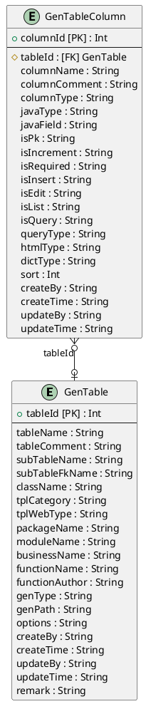
# GenTableColumn

## Description


## Columns

|Name | Type | Default | Nullable | Unique | Children | Parent | Comment|
|--- | --- | --- | --- | --- | --- | --- | ---|
|columnId | Int | autoincrement | false | true |  |  | |
|tableId | Int |  | true | false |  | [GenTable](#gentable) | |
|columnName | String |  | true | false |  |  | |
|columnComment | String |  | true | false |  |  | |
|columnType | String |  | true | false |  |  | |
|javaType | String |  | true | false |  |  | |
|javaField | String |  | true | false |  |  | |
|isPk | String |  | true | false |  |  | |
|isIncrement | String |  | true | false |  |  | |
|isRequired | String |  | true | false |  |  | |
|isInsert | String |  | true | false |  |  | |
|isEdit | String |  | true | false |  |  | |
|isList | String |  | true | false |  |  | |
|isQuery | String |  | true | false |  |  | |
|queryType | String | EQ | true | false |  |  | |
|htmlType | String |  | true | false |  |  | |
|dictType | String |  | true | false |  |  | |
|sort | Int |  | true | false |  |  | |
|createBy | String |  | true | false |  |  | |
|createTime | String |  | true | false |  |  | |
|updateBy | String |  | true | false |  |  | |
|updateTime | String |  | true | false |  |  | |

## ER diagram


# SysConfig

## Description


## Columns

|Name | Type | Default | Nullable | Unique | Children | Parent | Comment|
|--- | --- | --- | --- | --- | --- | --- | ---|
|configId | Int | autoincrement | false | true |  |  | |
|configName | String |  | true | false |  |  | |
|configKey | String |  | true | false |  |  | |
|configValue | String |  | true | false |  |  | |
|configType | String | N | true | false |  |  | |
|createBy | String |  | true | false |  |  | |
|createTime | String |  | true | false |  |  | |
|updateBy | String |  | true | false |  |  | |
|updateTime | String |  | true | false |  |  | |
|remark | String |  | true | false |  |  | |

## ER diagram

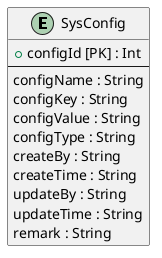
# SysDept

## Description


## Columns

|Name | Type | Default | Nullable | Unique | Children | Parent | Comment|
|--- | --- | --- | --- | --- | --- | --- | ---|
|deptId | Int | autoincrement | false | true | [SysRoleDept](#sysroledept), [SysUser](#sysuser) |  | |
|parentId | Int |  | true | false |  |  | |
|ancestors | String |  | true | false |  |  | |
|deptName | String |  | true | false |  |  | |
|orderNum | Int |  | true | false |  |  | |
|leader | String |  | true | false |  |  | |
|phone | String |  | true | false |  |  | |
|email | String |  | true | false |  |  | |
|status | String | 1 | true | false |  |  | |
|createBy | String |  | true | false |  |  | |
|createTime | String |  | true | false |  |  | |
|updateBy | String |  | true | false |  |  | |
|updateTime | String |  | true | false |  |  | |

## ER diagram

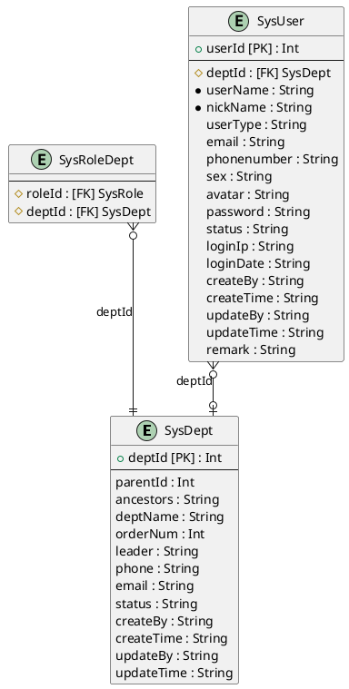
# SysDictData

## Description


## Columns

|Name | Type | Default | Nullable | Unique | Children | Parent | Comment|
|--- | --- | --- | --- | --- | --- | --- | ---|
|dictCode | Int | autoincrement | false | true |  |  | |
|dictSort | Int |  | true | false |  |  | |
|dictLabel | String |  | true | false |  |  | |
|dictValue | String |  | true | false |  |  | |
|dictType | String |  | true | false |  | [SysDictType](#sysdicttype) | |
|cssClass | String |  | true | false |  |  | |
|listClass | String |  | true | false |  |  | |
|isDefault | String | N | true | false |  |  | |
|status | String | 1 | true | false |  |  | |
|createBy | String |  | true | false |  |  | |
|createTime | String |  | true | false |  |  | |
|updateBy | String |  | true | false |  |  | |
|updateTime | String |  | true | false |  |  | |
|remark | String |  | true | false |  |  | |

## ER diagram

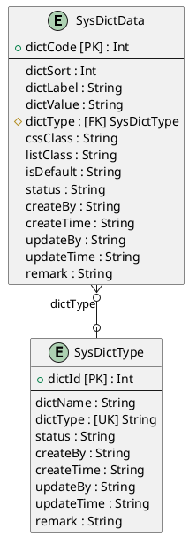
# SysDictType

## Description


## Columns

|Name | Type | Default | Nullable | Unique | Children | Parent | Comment|
|--- | --- | --- | --- | --- | --- | --- | ---|
|dictId | Int | autoincrement | false | true |  |  | |
|dictName | String |  | true | false |  |  | |
|dictType | String |  | true | true | [SysDictData](#sysdictdata) |  | |
|status | String | 1 | true | false |  |  | |
|createBy | String |  | true | false |  |  | |
|createTime | String |  | true | false |  |  | |
|updateBy | String |  | true | false |  |  | |
|updateTime | String |  | true | false |  |  | |
|remark | String |  | true | false |  |  | |

## ER diagram


# SysLogininfor

## Description


## Columns

|Name | Type | Default | Nullable | Unique | Children | Parent | Comment|
|--- | --- | --- | --- | --- | --- | --- | ---|
|infoId | Int | autoincrement | false | true |  |  | |
|userName | String |  | true | false |  |  | |
|ipaddr | String |  | true | false |  |  | |
|loginLocation | String |  | true | false |  |  | |
|browser | String |  | true | false |  |  | |
|os | String |  | true | false |  |  | |
|status | String | 1 | true | false |  |  | |
|msg | String |  | true | false |  |  | |
|loginTime | String |  | true | false |  |  | |

## ER diagram

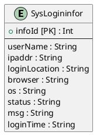
# SysMenu

## Description


## Columns

|Name | Type | Default | Nullable | Unique | Children | Parent | Comment|
|--- | --- | --- | --- | --- | --- | --- | ---|
|menuId | Int | autoincrement | false | true | [SysRoleMenu](#sysrolemenu) |  | |
|menuName | String |  | false | false |  |  | |
|parentId | Int |  | true | false |  |  | |
|orderNum | Int |  | true | false |  |  | |
|path | String |  | true | false |  |  | |
|component | String |  | true | false |  |  | |
|query | String |  | true | false |  |  | |
|isFrame | Int |  | true | false |  |  | |
|isCache | Int | 1 | true | false |  |  | |
|menuType | String |  | true | false |  |  | |
|visible | String | 1 | true | false |  |  | |
|status | String | 1 | true | false |  |  | |
|perms | String |  | true | false |  |  | |
|icon | String | # | true | false |  |  | |
|createBy | String |  | true | false |  |  | |
|createTime | String |  | true | false |  |  | |
|updateBy | String |  | true | false |  |  | |
|updateTime | String |  | true | false |  |  | |
|remark | String |  | true | false |  |  | |

## ER diagram

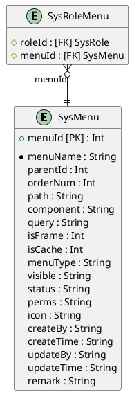
# SysNotice

## Description


## Columns

|Name | Type | Default | Nullable | Unique | Children | Parent | Comment|
|--- | --- | --- | --- | --- | --- | --- | ---|
|noticeId | Int | autoincrement | false | true |  |  | |
|noticeTitle | String |  | false | false |  |  | |
|noticeType | String |  | false | false |  |  | |
|noticeContent | String |  | true | false |  |  | |
|status | String | 1 | true | false |  |  | |
|createBy | String |  | true | false |  |  | |
|createTime | String |  | true | false |  |  | |
|updateBy | String |  | true | false |  |  | |
|updateTime | String |  | true | false |  |  | |
|remark | String |  | true | false |  |  | |

## ER diagram

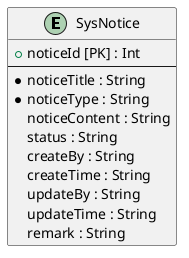
# SysPost

## Description


## Columns

|Name | Type | Default | Nullable | Unique | Children | Parent | Comment|
|--- | --- | --- | --- | --- | --- | --- | ---|
|postId | Int | autoincrement | false | true | [SysUserPost](#sysuserpost) |  | |
|postCode | String |  | false | false |  |  | |
|postName | String |  | false | false |  |  | |
|postSort | Int |  | false | false |  |  | |
|status | String | 1 | false | false |  |  | |
|createBy | String |  | true | false |  |  | |
|createTime | String |  | true | false |  |  | |
|updateBy | String |  | true | false |  |  | |
|updateTime | String |  | true | false |  |  | |
|remark | String |  | true | false |  |  | |

## ER diagram

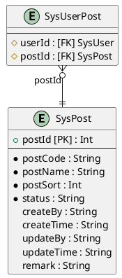
# SysUserPost

## Description


## Columns

|Name | Type | Default | Nullable | Unique | Children | Parent | Comment|
|--- | --- | --- | --- | --- | --- | --- | ---|
|userId | Int |  | false | false |  | [SysUser](#sysuser) | |
|postId | Int |  | false | false |  | [SysPost](#syspost) | |

## ER diagram

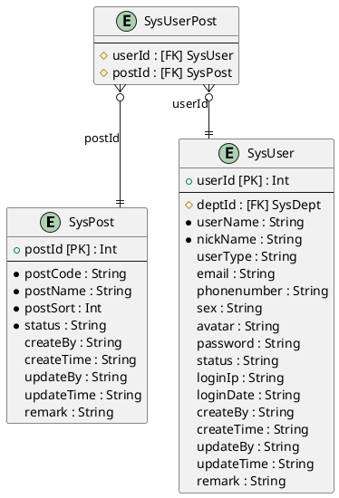
# SysRoleDept

## Description


## Columns

|Name | Type | Default | Nullable | Unique | Children | Parent | Comment|
|--- | --- | --- | --- | --- | --- | --- | ---|
|roleId | Int |  | false | false |  | [SysRole](#sysrole) | |
|deptId | Int |  | false | false |  | [SysDept](#sysdept) | |

## ER diagram

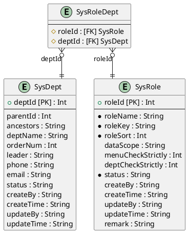
# SysRoleMenu

## Description


## Columns

|Name | Type | Default | Nullable | Unique | Children | Parent | Comment|
|--- | --- | --- | --- | --- | --- | --- | ---|
|roleId | Int |  | false | false |  | [SysRole](#sysrole) | |
|menuId | Int |  | false | false |  | [SysMenu](#sysmenu) | |

## ER diagram

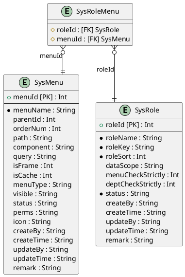
# SysUser

## Description


## Columns

|Name | Type | Default | Nullable | Unique | Children | Parent | Comment|
|--- | --- | --- | --- | --- | --- | --- | ---|
|userId | Int | autoincrement | false | true | [SysUserPost](#sysuserpost), [SysUserRole](#sysuserrole) |  | |
|deptId | Int |  | true | false |  | [SysDept](#sysdept) | |
|userName | String |  | false | false |  |  | |
|nickName | String |  | false | false |  |  | |
|userType | String | 00 | true | false |  |  | |
|email | String |  | true | false |  |  | |
|phonenumber | String |  | true | false |  |  | |
|sex | String | 0 | true | false |  |  | |
|avatar | String |  | true | false |  |  | |
|password | String |  | true | false |  |  | |
|status | String | 1 | true | false |  |  | |
|loginIp | String |  | true | false |  |  | |
|loginDate | String |  | true | false |  |  | |
|createBy | String |  | true | false |  |  | |
|createTime | String |  | true | false |  |  | |
|updateBy | String |  | true | false |  |  | |
|updateTime | String |  | true | false |  |  | |
|remark | String |  | true | false |  |  | |

## ER diagram

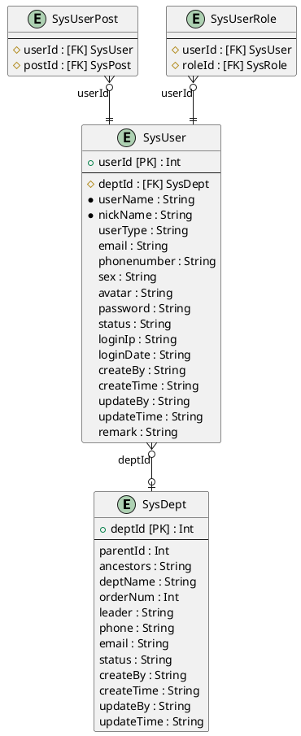
# SysRole

## Description


## Columns

|Name | Type | Default | Nullable | Unique | Children | Parent | Comment|
|--- | --- | --- | --- | --- | --- | --- | ---|
|roleId | Int | autoincrement | false | true | [SysRoleDept](#sysroledept), [SysRoleMenu](#sysrolemenu), [SysUserRole](#sysuserrole) |  | |
|roleName | String |  | false | false |  |  | |
|roleKey | String |  | false | false |  |  | |
|roleSort | Int |  | false | false |  |  | |
|dataScope | String | 5 | true | false |  |  | |
|menuCheckStrictly | Int | 1 | true | false |  |  | |
|deptCheckStrictly | Int | 1 | true | false |  |  | |
|status | String | 1 | false | false |  |  | |
|createBy | String |  | true | false |  |  | |
|createTime | String |  | true | false |  |  | |
|updateBy | String |  | true | false |  |  | |
|updateTime | String |  | true | false |  |  | |
|remark | String |  | true | false |  |  | |

## ER diagram

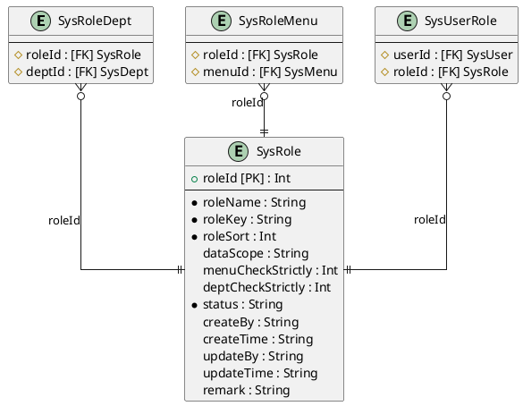
# SysUserRole

## Description


## Columns

|Name | Type | Default | Nullable | Unique | Children | Parent | Comment|
|--- | --- | --- | --- | --- | --- | --- | ---|
|userId | Int |  | false | false |  | [SysUser](#sysuser) | |
|roleId | Int |  | false | false |  | [SysRole](#sysrole) | |

## ER diagram

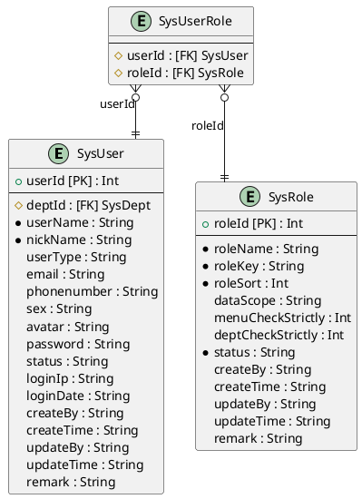
# collection

## Description


## Columns

|Name | Type | Default | Nullable | Unique | Children | Parent | Comment|
|--- | --- | --- | --- | --- | --- | --- | ---|
|id | Int | autoincrement | false | true | [tr_order](#tr_order), [tr_transfer](#tr_transfer) |  | |
|collection_name | String |  | true | false |  |  | |
|ticket_id | Int |  | true | false |  | [ticket](#ticket) | |
|ticket_type | Int | 1 | false | false |  |  | |
|chain_type | Int | 1 | true | false |  |  | |
|casting_uid | Int |  | false | false |  |  | |
|casting_name | String |  | true | false |  |  | |
|daop_casting_id | Int |  | true | false |  |  | |
|daop_casting_address | String |  | true | false |  |  | |
|owner_uid | Int |  | false | false |  | [user](#user) | |
|owner_name | String |  | true | false |  |  | |
|daop_user_id | Int |  | true | false |  |  | |
|daop_user_address | String |  | true | false |  |  | |
|license_id | Int |  | false | false |  |  | |
|shared_uid | Int |  | true | false |  |  | |
|price | Int |  | false | false |  |  | |
|trade_time | DateTime |  | true | false |  |  | |
|daop_collection_id | Int |  | true | false |  |  | |
|out_ticket_id | Int |  | true | false |  |  | |
|token_id | String |  | true | false |  |  | |
|collection_hash | String |  | false | false |  |  | |
|mint_tx_id | String |  | true | false |  |  | |
|mint_chain_status | Int |  | true | false |  |  | |
|mint_chain_time | DateTime |  | true | false |  |  | |
|transfer_tx_id | String |  | true | false |  |  | |
|transfer_chain_status | Int |  | true | false |  |  | |
|transfer_chain_time | DateTime |  | true | false |  |  | |
|checkeIn_tx_id | String |  | true | false |  |  | |
|checkIn_chain_status | Int |  | true | false |  |  | |
|checkIn_chain_time | DateTime |  | true | false |  |  | |
|credential | String |  | true | false |  |  | |
|last_credential | String |  | true | false |  |  | |
|sale_status | Int |  | true | false |  |  | |
|available_status | Int | 1 | true | false |  |  | |
|available_time | DateTime |  | true | false |  |  | |
|available_expire_time | DateTime |  | true | false |  |  | |
|check_code | String |  | false | false |  |  | |
|authorization_id | Int |  | true | false |  |  | |
|authorization_code | String |  | false | false |  |  | |
|modify_time | DateTime | now | true | false |  |  | |
|create_time | DateTime | now | true | false |  |  | |
|dar_status | Int |  | true | false |  |  | |
|old_status | Int |  | true | false |  |  | |
|certificate_url | String | - | true | false |  |  | |
|block_number | Int |  | true | false |  |  | |
|sjt_status | Int |  | true | false |  |  | |
|reg_code | String |  | true | false |  |  | |
|asset_number | String |  | true | false |  |  | |

## ER diagram

```plantuml
@startuml collection
skinparam linetype ortho
entity "collection" as collection {
+ id [PK] : Int 
--
  collection_name : String
  # ticket_id : [FK] ticket
  * ticket_type : Int
  chain_type : Int
  * casting_uid : Int
  casting_name : String
  daop_casting_id : Int
  daop_casting_address : String
  # owner_uid : [FK] user
  owner_name : String
  daop_user_id : Int
  daop_user_address : String
  * license_id : Int
  shared_uid : Int
  * price : Int
  trade_time : DateTime
  daop_collection_id : Int
  out_ticket_id : Int
  token_id : String
  * collection_hash : String
  mint_tx_id : String
  mint_chain_status : Int
  mint_chain_time : DateTime
  transfer_tx_id : String
  transfer_chain_status : Int
  transfer_chain_time : DateTime
  checkeIn_tx_id : String
  checkIn_chain_status : Int
  checkIn_chain_time : DateTime
  credential : String
  last_credential : String
  sale_status : Int
  available_status : Int
  available_time : DateTime
  available_expire_time : DateTime
  * check_code : String
  authorization_id : Int
  * authorization_code : String
  modify_time : DateTime
  create_time : DateTime
  dar_status : Int
  old_status : Int
  certificate_url : String
  block_number : Int
  sjt_status : Int
  reg_code : String
  asset_number : String
}

entity "ticket" as ticket {
+ id [PK] : Int 
--
  * ticket_name : String
  ticket_type : Int
  chain_type : Int
  cover_uri : String
  content_uri : String
  td_files : Json
  creator_uid : Int
  creator_name : String
  creator_avatar : String
  daop_user_id : Int
  daop_user_address : String
  publisher_id : Int
  publisher_name : String
  publisher_logo : String
  * amount : Int
  sold_amount : Int
  sku_balance : Int
  * price : Int
  available_time : DateTime
  expire_time : DateTime
  sale_begin_time : DateTime
  sale_end_time : DateTime
  description : String
  usage : String
  sale_status : Int
  available_status : Int
  authorization_id : Int
  * authorization_code : String
  did_credential : String
  copyright_credential : String
  authorization_credential : String
  chain_txid : String
  chain_block_number : Int
  chain_time : Int
  chain_status : Int
  is_sale : Int
  modify_time : DateTime
  create_time : DateTime
  registration_id : Int
  send_status : Int
  landing_uri : String
  download_status : Int
  origin_uri : String
  creation_date : DateTime
  start_date : DateTime
}

entity "tr_order" as tr_order {
+ order_id [PK] : Int 
--
  * order_no : [UK] String
  # ticket_id : [FK] ticket
  ticket_did_credential : String
  ticket_copyright_credential : String
  ticket_authorization_credential : String
  # collection_id : [FK] collection
  collection_name : String
  * collection_hash : String
  collection_credential : String
  collection_last_credential : String
  collection_token_id : String
  daop_collection_id : Int
  * seller_uid : Int
  seller_daop_user_id : Int
  seller_daop_user_address : String
  seller_mobile : String
  * buyer_uid : Int
  buyer_realname : String
  buyer_mobile : String
  buyer_nickname : String
  buyer_daop_user_id : Int
  buyer_daop_user_address : String
  shared_uid : Int
  * price : Int
  amount : Int
  check_in : Int
  pay_channel : String
  pay_scene : String
  pay_trade_no : String
  pay_time : DateTime
  pay_status : Int
  pay_failed_reason : String
  * transfer_status : Int
  expire_time : DateTime
  expire_time_at : BigInt
  * status : Int
  deleted_at : Int
  * modify_time : DateTime
  create_time : DateTime
}

entity "tr_transfer" as tr_transfer {
+ id [PK] : Int 
--
  # collection_id : [FK] collection
  collection_credential : String
  collection_last_credential : String
  * token_id : String
  # order_id : [FK] tr_order
  * transfer_uid : Int
  transfer_name : String
  * receiver_uid : Int
  receiver_name : String
  receiver_mobile : String
  tx_id : String
  chain_status : Int
  chain_time : DateTime
  transfer_type : Int
  modify_time : DateTime
  create_time : DateTime
  block_number : Int
}

entity "user" as user {
+ id [PK] : Int 
--
  wx_mini_openid : String
  union_id : String
  mobile : String
  country_code : String
  full_mobile : String
  nick_name : String
  avatar : String
  description : String
  gendar : Int
  user_type : Int
  is_publisher : Int
  id_card_no : String
  realname : String
  realname_state : Int
  realname_type : Int
  realname_time : DateTime
  daop_account_id : Int
  daop_user_id : Int
  daop_user_address : String
  tags : String
  available_status : Int
  create_time : DateTime
  modify_time : DateTime
}

' Relations
collection }o--o| ticket: ticket_id
collection }o--|| user: owner_uid
tr_order }o--|| ticket: ticket_id
tr_order }o--|| collection: collection_id
tr_transfer }o--|| collection: collection_id
tr_transfer }o--|| tr_order: order_id
' ManyToMany Relations
' enum relations
@enduml
```
# init_mobile

## Description


## Columns

|Name | Type | Default | Nullable | Unique | Children | Parent | Comment|
|--- | --- | --- | --- | --- | --- | --- | ---|
|id | Int | autoincrement | false | true |  |  | |
|mobile | String |  | true | false |  |  | |

## ER diagram

```plantuml
@startuml init_mobile
skinparam linetype ortho
entity "init_mobile" as init_mobile {
+ id [PK] : Int 
--
  mobile : String
}

' Relations
' ManyToMany Relations
' enum relations
@enduml
```
# platform_token

## Description


## Columns

|Name | Type | Default | Nullable | Unique | Children | Parent | Comment|
|--- | --- | --- | --- | --- | --- | --- | ---|
|id | Int | autoincrement | false | true |  |  | |
|platform | String |  | true | false |  |  | |
|mobile | String |  | true | false |  |  | |
|token | String |  | true | false |  |  | |
|expire_in | BigInt |  | true | false |  |  | |
|create_time | DateTime | now | true | false |  |  | |

## ER diagram

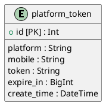
# publisher

## Description


## Columns

|Name | Type | Default | Nullable | Unique | Children | Parent | Comment|
|--- | --- | --- | --- | --- | --- | --- | ---|
|id | Int | autoincrement | false | true |  |  | |
|publisher_name | String |  | true | false |  |  | |
|industry | String |  | true | false |  |  | |
|logo | String |  | true | false |  |  | |

## ER diagram

```plantuml
@startuml publisher
skinparam linetype ortho
entity "publisher" as publisher {
+ id [PK] : Int 
--
  publisher_name : String
  industry : String
  logo : String
}

' Relations
' ManyToMany Relations
' enum relations
@enduml
```
# ticket

## Description


## Columns

|Name | Type | Default | Nullable | Unique | Children | Parent | Comment|
|--- | --- | --- | --- | --- | --- | --- | ---|
|id | Int | autoincrement | false | true | [collection](#collection), [tr_order](#tr_order), [resource](#resource) |  | |
|ticket_name | String |  | false | false |  |  | |
|ticket_type | Int | 1 | true | false |  |  | |
|chain_type | Int | 1 | true | false |  |  | |
|cover_uri | String |  | true | false |  |  | |
|content_uri | String |  | true | false |  |  | |
|td_files | Json |  | true | false |  |  | |
|creator_uid | Int |  | true | false |  |  | |
|creator_name | String |  | true | false |  |  | |
|creator_avatar | String |  | true | false |  |  | |
|daop_user_id | Int |  | true | false |  |  | |
|daop_user_address | String |  | true | false |  |  | |
|publisher_id | Int |  | true | false |  |  | |
|publisher_name | String |  | true | false |  |  | |
|publisher_logo | String |  | true | false |  |  | |
|amount | Int | 1 | false | false |  |  | |
|sold_amount | Int |  | true | false |  |  | |
|sku_balance | Int |  | true | false |  |  | |
|price | Int |  | false | false |  |  | |
|available_time | DateTime |  | true | false |  |  | |
|expire_time | DateTime |  | true | false |  |  | |
|sale_begin_time | DateTime |  | true | false |  |  | |
|sale_end_time | DateTime |  | true | false |  |  | |
|description | String |  | true | false |  |  | |
|usage | String |  | true | false |  |  | |
|sale_status | Int | 1 | true | false |  |  | |
|available_status | Int | 1 | true | false |  |  | |
|authorization_id | Int |  | true | false |  |  | |
|authorization_code | String |  | false | false |  |  | |
|did_credential | String |  | true | false |  |  | |
|copyright_credential | String |  | true | false |  |  | |
|authorization_credential | String |  | true | false |  |  | |
|chain_txid | String |  | true | false |  |  | |
|chain_block_number | Int |  | true | false |  |  | |
|chain_time | Int |  | true | false |  |  | |
|chain_status | Int |  | true | false |  |  | |
|is_sale | Int | 1 | true | false |  |  | |
|modify_time | DateTime | now | true | false |  |  | |
|create_time | DateTime | now | true | false |  |  | |
|registration_id | Int |  | true | false |  |  | |
|send_status | Int |  | true | false |  |  | |
|landing_uri | String |  | true | false |  |  | |
|download_status | Int |  | true | false |  |  | |
|origin_uri | String |  | true | false |  |  | |
|creation_date | DateTime |  | true | false |  |  | |
|start_date | DateTime |  | true | false |  |  | |

## ER diagram

```plantuml
@startuml ticket
skinparam linetype ortho
entity "collection" as collection {
+ id [PK] : Int 
--
  collection_name : String
  # ticket_id : [FK] ticket
  * ticket_type : Int
  chain_type : Int
  * casting_uid : Int
  casting_name : String
  daop_casting_id : Int
  daop_casting_address : String
  # owner_uid : [FK] user
  owner_name : String
  daop_user_id : Int
  daop_user_address : String
  * license_id : Int
  shared_uid : Int
  * price : Int
  trade_time : DateTime
  daop_collection_id : Int
  out_ticket_id : Int
  token_id : String
  * collection_hash : String
  mint_tx_id : String
  mint_chain_status : Int
  mint_chain_time : DateTime
  transfer_tx_id : String
  transfer_chain_status : Int
  transfer_chain_time : DateTime
  checkeIn_tx_id : String
  checkIn_chain_status : Int
  checkIn_chain_time : DateTime
  credential : String
  last_credential : String
  sale_status : Int
  available_status : Int
  available_time : DateTime
  available_expire_time : DateTime
  * check_code : String
  authorization_id : Int
  * authorization_code : String
  modify_time : DateTime
  create_time : DateTime
  dar_status : Int
  old_status : Int
  certificate_url : String
  block_number : Int
  sjt_status : Int
  reg_code : String
  asset_number : String
}

entity "ticket" as ticket {
+ id [PK] : Int 
--
  * ticket_name : String
  ticket_type : Int
  chain_type : Int
  cover_uri : String
  content_uri : String
  td_files : Json
  creator_uid : Int
  creator_name : String
  creator_avatar : String
  daop_user_id : Int
  daop_user_address : String
  publisher_id : Int
  publisher_name : String
  publisher_logo : String
  * amount : Int
  sold_amount : Int
  sku_balance : Int
  * price : Int
  available_time : DateTime
  expire_time : DateTime
  sale_begin_time : DateTime
  sale_end_time : DateTime
  description : String
  usage : String
  sale_status : Int
  available_status : Int
  authorization_id : Int
  * authorization_code : String
  did_credential : String
  copyright_credential : String
  authorization_credential : String
  chain_txid : String
  chain_block_number : Int
  chain_time : Int
  chain_status : Int
  is_sale : Int
  modify_time : DateTime
  create_time : DateTime
  registration_id : Int
  send_status : Int
  landing_uri : String
  download_status : Int
  origin_uri : String
  creation_date : DateTime
  start_date : DateTime
}

entity "tr_order" as tr_order {
+ order_id [PK] : Int 
--
  * order_no : [UK] String
  # ticket_id : [FK] ticket
  ticket_did_credential : String
  ticket_copyright_credential : String
  ticket_authorization_credential : String
  # collection_id : [FK] collection
  collection_name : String
  * collection_hash : String
  collection_credential : String
  collection_last_credential : String
  collection_token_id : String
  daop_collection_id : Int
  * seller_uid : Int
  seller_daop_user_id : Int
  seller_daop_user_address : String
  seller_mobile : String
  * buyer_uid : Int
  buyer_realname : String
  buyer_mobile : String
  buyer_nickname : String
  buyer_daop_user_id : Int
  buyer_daop_user_address : String
  shared_uid : Int
  * price : Int
  amount : Int
  check_in : Int
  pay_channel : String
  pay_scene : String
  pay_trade_no : String
  pay_time : DateTime
  pay_status : Int
  pay_failed_reason : String
  * transfer_status : Int
  expire_time : DateTime
  expire_time_at : BigInt
  * status : Int
  deleted_at : Int
  * modify_time : DateTime
  create_time : DateTime
}

entity "resource" as resource {
+ id [PK] : Int 
--
  # ticket_id : [FK] ticket
  name : String
  resource_url : String
  order : Int
  create_by : String
  create_time : String
  update_by : String
  update_time : String
  status : Int
  remark : String
}

' Relations
collection }o--o| ticket: ticket_id
tr_order }o--|| ticket: ticket_id
tr_order }o--|| collection: collection_id
resource }o--|| ticket: ticket_id
' ManyToMany Relations
' enum relations
@enduml
```
# tr_order

## Description


## Columns

|Name | Type | Default | Nullable | Unique | Children | Parent | Comment|
|--- | --- | --- | --- | --- | --- | --- | ---|
|order_id | Int | autoincrement | false | true | [tr_transfer](#tr_transfer) |  | |
|order_no | String |  | false | true |  |  | |
|ticket_id | Int |  | false | false |  | [ticket](#ticket) | |
|ticket_did_credential | String |  | true | false |  |  | |
|ticket_copyright_credential | String |  | true | false |  |  | |
|ticket_authorization_credential | String |  | true | false |  |  | |
|collection_id | Int |  | false | false |  | [collection](#collection) | |
|collection_name | String |  | true | false |  |  | |
|collection_hash | String |  | false | false |  |  | |
|collection_credential | String |  | true | false |  |  | |
|collection_last_credential | String |  | true | false |  |  | |
|collection_token_id | String |  | true | false |  |  | |
|daop_collection_id | Int |  | true | false |  |  | |
|seller_uid | Int |  | false | false |  |  | |
|seller_daop_user_id | Int |  | true | false |  |  | |
|seller_daop_user_address | String |  | true | false |  |  | |
|seller_mobile | String |  | true | false |  |  | |
|buyer_uid | Int |  | false | false |  |  | |
|buyer_realname | String |  | true | false |  |  | |
|buyer_mobile | String |  | true | false |  |  | |
|buyer_nickname | String |  | true | false |  |  | |
|buyer_daop_user_id | Int |  | true | false |  |  | |
|buyer_daop_user_address | String |  | true | false |  |  | |
|shared_uid | Int |  | true | false |  |  | |
|price | Int |  | false | false |  |  | |
|amount | Int | 1 | true | false |  |  | |
|check_in | Int |  | true | false |  |  | |
|pay_channel | String |  | true | false |  |  | |
|pay_scene | String |  | true | false |  |  | |
|pay_trade_no | String |  | true | false |  |  | |
|pay_time | DateTime |  | true | false |  |  | |
|pay_status | Int |  | true | false |  |  | |
|pay_failed_reason | String |  | true | false |  |  | |
|transfer_status | Int |  | false | false |  |  | |
|expire_time | DateTime |  | true | false |  |  | |
|expire_time_at | BigInt | 0 | true | false |  |  | |
|status | Int | 1 | false | false |  |  | |
|deleted_at | Int |  | true | false |  |  | |
|modify_time | DateTime | now | false | false |  |  | |
|create_time | DateTime | now | true | false |  |  | |

## ER diagram

```plantuml
@startuml tr_order
skinparam linetype ortho
entity "collection" as collection {
+ id [PK] : Int 
--
  collection_name : String
  # ticket_id : [FK] ticket
  * ticket_type : Int
  chain_type : Int
  * casting_uid : Int
  casting_name : String
  daop_casting_id : Int
  daop_casting_address : String
  # owner_uid : [FK] user
  owner_name : String
  daop_user_id : Int
  daop_user_address : String
  * license_id : Int
  shared_uid : Int
  * price : Int
  trade_time : DateTime
  daop_collection_id : Int
  out_ticket_id : Int
  token_id : String
  * collection_hash : String
  mint_tx_id : String
  mint_chain_status : Int
  mint_chain_time : DateTime
  transfer_tx_id : String
  transfer_chain_status : Int
  transfer_chain_time : DateTime
  checkeIn_tx_id : String
  checkIn_chain_status : Int
  checkIn_chain_time : DateTime
  credential : String
  last_credential : String
  sale_status : Int
  available_status : Int
  available_time : DateTime
  available_expire_time : DateTime
  * check_code : String
  authorization_id : Int
  * authorization_code : String
  modify_time : DateTime
  create_time : DateTime
  dar_status : Int
  old_status : Int
  certificate_url : String
  block_number : Int
  sjt_status : Int
  reg_code : String
  asset_number : String
}

entity "ticket" as ticket {
+ id [PK] : Int 
--
  * ticket_name : String
  ticket_type : Int
  chain_type : Int
  cover_uri : String
  content_uri : String
  td_files : Json
  creator_uid : Int
  creator_name : String
  creator_avatar : String
  daop_user_id : Int
  daop_user_address : String
  publisher_id : Int
  publisher_name : String
  publisher_logo : String
  * amount : Int
  sold_amount : Int
  sku_balance : Int
  * price : Int
  available_time : DateTime
  expire_time : DateTime
  sale_begin_time : DateTime
  sale_end_time : DateTime
  description : String
  usage : String
  sale_status : Int
  available_status : Int
  authorization_id : Int
  * authorization_code : String
  did_credential : String
  copyright_credential : String
  authorization_credential : String
  chain_txid : String
  chain_block_number : Int
  chain_time : Int
  chain_status : Int
  is_sale : Int
  modify_time : DateTime
  create_time : DateTime
  registration_id : Int
  send_status : Int
  landing_uri : String
  download_status : Int
  origin_uri : String
  creation_date : DateTime
  start_date : DateTime
}

entity "tr_order" as tr_order {
+ order_id [PK] : Int 
--
  * order_no : [UK] String
  # ticket_id : [FK] ticket
  ticket_did_credential : String
  ticket_copyright_credential : String
  ticket_authorization_credential : String
  # collection_id : [FK] collection
  collection_name : String
  * collection_hash : String
  collection_credential : String
  collection_last_credential : String
  collection_token_id : String
  daop_collection_id : Int
  * seller_uid : Int
  seller_daop_user_id : Int
  seller_daop_user_address : String
  seller_mobile : String
  * buyer_uid : Int
  buyer_realname : String
  buyer_mobile : String
  buyer_nickname : String
  buyer_daop_user_id : Int
  buyer_daop_user_address : String
  shared_uid : Int
  * price : Int
  amount : Int
  check_in : Int
  pay_channel : String
  pay_scene : String
  pay_trade_no : String
  pay_time : DateTime
  pay_status : Int
  pay_failed_reason : String
  * transfer_status : Int
  expire_time : DateTime
  expire_time_at : BigInt
  * status : Int
  deleted_at : Int
  * modify_time : DateTime
  create_time : DateTime
}

entity "tr_transfer" as tr_transfer {
+ id [PK] : Int 
--
  # collection_id : [FK] collection
  collection_credential : String
  collection_last_credential : String
  * token_id : String
  # order_id : [FK] tr_order
  * transfer_uid : Int
  transfer_name : String
  * receiver_uid : Int
  receiver_name : String
  receiver_mobile : String
  tx_id : String
  chain_status : Int
  chain_time : DateTime
  transfer_type : Int
  modify_time : DateTime
  create_time : DateTime
  block_number : Int
}

' Relations
collection }o--o| ticket: ticket_id
tr_order }o--|| ticket: ticket_id
tr_order }o--|| collection: collection_id
tr_transfer }o--|| collection: collection_id
tr_transfer }o--|| tr_order: order_id
' ManyToMany Relations
' enum relations
@enduml
```
# tr_pay_notification

## Description


## Columns

|Name | Type | Default | Nullable | Unique | Children | Parent | Comment|
|--- | --- | --- | --- | --- | --- | --- | ---|
|id | Int | autoincrement | false | true |  |  | |
|pay_channel | String |  | true | false |  |  | |
|order_no | String |  | true | false |  |  | |
|data | Json |  | true | false |  |  | |
|modify_time | DateTime | now | true | false |  |  | |
|create_time | DateTime | now | true | false |  |  | |

## ER diagram

```plantuml
@startuml tr_pay_notification
skinparam linetype ortho
entity "tr_pay_notification" as tr_pay_notification {
+ id [PK] : Int 
--
  pay_channel : String
  order_no : String
  data : Json
  modify_time : DateTime
  create_time : DateTime
}

' Relations
' ManyToMany Relations
' enum relations
@enduml
```
# tr_transfer

## Description


## Columns

|Name | Type | Default | Nullable | Unique | Children | Parent | Comment|
|--- | --- | --- | --- | --- | --- | --- | ---|
|id | Int | autoincrement | false | true |  |  | |
|collection_id | Int |  | false | false |  | [collection](#collection) | |
|collection_credential | String |  | true | false |  |  | |
|collection_last_credential | String |  | true | false |  |  | |
|token_id | String |  | false | false |  |  | |
|order_id | Int |  | false | false |  | [tr_order](#tr_order) | |
|transfer_uid | Int |  | false | false |  |  | |
|transfer_name | String |  | true | false |  |  | |
|receiver_uid | Int |  | false | false |  |  | |
|receiver_name | String |  | true | false |  |  | |
|receiver_mobile | String |  | true | false |  |  | |
|tx_id | String |  | true | false |  |  | |
|chain_status | Int |  | true | false |  |  | |
|chain_time | DateTime |  | true | false |  |  | |
|transfer_type | Int | 1 | true | false |  |  | |
|modify_time | DateTime | now | true | false |  |  | |
|create_time | DateTime | now | true | false |  |  | |
|block_number | Int |  | true | false |  |  | |

## ER diagram

```plantuml
@startuml tr_transfer
skinparam linetype ortho
entity "collection" as collection {
+ id [PK] : Int 
--
  collection_name : String
  # ticket_id : [FK] ticket
  * ticket_type : Int
  chain_type : Int
  * casting_uid : Int
  casting_name : String
  daop_casting_id : Int
  daop_casting_address : String
  # owner_uid : [FK] user
  owner_name : String
  daop_user_id : Int
  daop_user_address : String
  * license_id : Int
  shared_uid : Int
  * price : Int
  trade_time : DateTime
  daop_collection_id : Int
  out_ticket_id : Int
  token_id : String
  * collection_hash : String
  mint_tx_id : String
  mint_chain_status : Int
  mint_chain_time : DateTime
  transfer_tx_id : String
  transfer_chain_status : Int
  transfer_chain_time : DateTime
  checkeIn_tx_id : String
  checkIn_chain_status : Int
  checkIn_chain_time : DateTime
  credential : String
  last_credential : String
  sale_status : Int
  available_status : Int
  available_time : DateTime
  available_expire_time : DateTime
  * check_code : String
  authorization_id : Int
  * authorization_code : String
  modify_time : DateTime
  create_time : DateTime
  dar_status : Int
  old_status : Int
  certificate_url : String
  block_number : Int
  sjt_status : Int
  reg_code : String
  asset_number : String
}

entity "tr_order" as tr_order {
+ order_id [PK] : Int 
--
  * order_no : [UK] String
  # ticket_id : [FK] ticket
  ticket_did_credential : String
  ticket_copyright_credential : String
  ticket_authorization_credential : String
  # collection_id : [FK] collection
  collection_name : String
  * collection_hash : String
  collection_credential : String
  collection_last_credential : String
  collection_token_id : String
  daop_collection_id : Int
  * seller_uid : Int
  seller_daop_user_id : Int
  seller_daop_user_address : String
  seller_mobile : String
  * buyer_uid : Int
  buyer_realname : String
  buyer_mobile : String
  buyer_nickname : String
  buyer_daop_user_id : Int
  buyer_daop_user_address : String
  shared_uid : Int
  * price : Int
  amount : Int
  check_in : Int
  pay_channel : String
  pay_scene : String
  pay_trade_no : String
  pay_time : DateTime
  pay_status : Int
  pay_failed_reason : String
  * transfer_status : Int
  expire_time : DateTime
  expire_time_at : BigInt
  * status : Int
  deleted_at : Int
  * modify_time : DateTime
  create_time : DateTime
}

entity "tr_transfer" as tr_transfer {
+ id [PK] : Int 
--
  # collection_id : [FK] collection
  collection_credential : String
  collection_last_credential : String
  * token_id : String
  # order_id : [FK] tr_order
  * transfer_uid : Int
  transfer_name : String
  * receiver_uid : Int
  receiver_name : String
  receiver_mobile : String
  tx_id : String
  chain_status : Int
  chain_time : DateTime
  transfer_type : Int
  modify_time : DateTime
  create_time : DateTime
  block_number : Int
}

' Relations
tr_order }o--|| collection: collection_id
tr_transfer }o--|| collection: collection_id
tr_transfer }o--|| tr_order: order_id
' ManyToMany Relations
' enum relations
@enduml
```
# user

## Description


## Columns

|Name | Type | Default | Nullable | Unique | Children | Parent | Comment|
|--- | --- | --- | --- | --- | --- | --- | ---|
|id | Int | autoincrement | false | true | [collection](#collection) |  | |
|wx_mini_openid | String |  | true | false |  |  | |
|union_id | String |  | true | false |  |  | |
|mobile | String |  | true | false |  |  | |
|country_code | String |  | true | false |  |  | |
|full_mobile | String |  | true | false |  |  | |
|nick_name | String |  | true | false |  |  | |
|avatar | String |  | true | false |  |  | |
|description | String |  | true | false |  |  | |
|gendar | Int |  | true | false |  |  | |
|user_type | Int | 1 | true | false |  |  | |
|is_publisher | Int | 2 | true | false |  |  | |
|id_card_no | String |  | true | false |  |  | |
|realname | String |  | true | false |  |  | |
|realname_state | Int |  | true | false |  |  | |
|realname_type | Int |  | true | false |  |  | |
|realname_time | DateTime |  | true | false |  |  | |
|daop_account_id | Int |  | true | false |  |  | |
|daop_user_id | Int |  | true | false |  |  | |
|daop_user_address | String |  | true | false |  |  | |
|tags | String |  | true | false |  |  | |
|available_status | Int | 1 | true | false |  |  | |
|create_time | DateTime | now | true | false |  |  | |
|modify_time | DateTime | now | true | false |  |  | |

# Indexes

|columns | index type | index name|
|--- | --- | ---|
|union_id,wx_mini_openid | unique | |

## ER diagram

```plantuml
@startuml user
skinparam linetype ortho
entity "collection" as collection {
+ id [PK] : Int 
--
  collection_name : String
  # ticket_id : [FK] ticket
  * ticket_type : Int
  chain_type : Int
  * casting_uid : Int
  casting_name : String
  daop_casting_id : Int
  daop_casting_address : String
  # owner_uid : [FK] user
  owner_name : String
  daop_user_id : Int
  daop_user_address : String
  * license_id : Int
  shared_uid : Int
  * price : Int
  trade_time : DateTime
  daop_collection_id : Int
  out_ticket_id : Int
  token_id : String
  * collection_hash : String
  mint_tx_id : String
  mint_chain_status : Int
  mint_chain_time : DateTime
  transfer_tx_id : String
  transfer_chain_status : Int
  transfer_chain_time : DateTime
  checkeIn_tx_id : String
  checkIn_chain_status : Int
  checkIn_chain_time : DateTime
  credential : String
  last_credential : String
  sale_status : Int
  available_status : Int
  available_time : DateTime
  available_expire_time : DateTime
  * check_code : String
  authorization_id : Int
  * authorization_code : String
  modify_time : DateTime
  create_time : DateTime
  dar_status : Int
  old_status : Int
  certificate_url : String
  block_number : Int
  sjt_status : Int
  reg_code : String
  asset_number : String
}

entity "user" as user {
+ id [PK] : Int 
--
  wx_mini_openid : String
  union_id : String
  mobile : String
  country_code : String
  full_mobile : String
  nick_name : String
  avatar : String
  description : String
  gendar : Int
  user_type : Int
  is_publisher : Int
  id_card_no : String
  realname : String
  realname_state : Int
  realname_type : Int
  realname_time : DateTime
  daop_account_id : Int
  daop_user_id : Int
  daop_user_address : String
  tags : String
  available_status : Int
  create_time : DateTime
  modify_time : DateTime
}

' Relations
collection }o--|| user: owner_uid
' ManyToMany Relations
' enum relations
@enduml
```
# declarex

## Description


## Columns

|Name | Type | Default | Nullable | Unique | Children | Parent | Comment|
|--- | --- | --- | --- | --- | --- | --- | ---|
|id | Int | autoincrement | false | true |  |  | |
|name | String |  | true | false |  |  | |
|content | String |  | true | false |  |  | |
|types | Int |  | true | false |  |  | |
|create_by | String |  | true | false |  |  | |
|create_time | String |  | true | false |  |  | |
|update_by | String |  | true | false |  |  | |
|update_time | String |  | true | false |  |  | |
|status | Int |  | true | false |  |  | |
|remark | String |  | true | false |  |  | |

## ER diagram

```plantuml
@startuml declarex
skinparam linetype ortho
entity "declarex" as declarex {
+ id [PK] : Int 
--
  name : String
  content : String
  types : Int
  create_by : String
  create_time : String
  update_by : String
  update_time : String
  status : Int
  remark : String
}

' Relations
' ManyToMany Relations
' enum relations
@enduml
```
# recommend_img

## Description


## Columns

|Name | Type | Default | Nullable | Unique | Children | Parent | Comment|
|--- | --- | --- | --- | --- | --- | --- | ---|
|id | Int | autoincrement | false | true |  |  | |
|name | String |  | true | false |  |  | |
|img | String |  | true | false |  |  | |
|link | String |  | true | false |  |  | |
|order | Int |  | true | false |  |  | |
|recommend | Int | 1 | true | false |  |  | |
|create_by | String |  | true | false |  |  | |
|create_time | String |  | true | false |  |  | |
|update_by | String |  | true | false |  |  | |
|update_time | String |  | true | false |  |  | |
|status | Int |  | true | false |  |  | |
|remark | String |  | true | false |  |  | |

## ER diagram

```plantuml
@startuml recommend_img
skinparam linetype ortho
entity "recommend_img" as recommend_img {
+ id [PK] : Int 
--
  name : String
  img : String
  link : String
  order : Int
  recommend : Int
  create_by : String
  create_time : String
  update_by : String
  update_time : String
  status : Int
  remark : String
}

' Relations
' ManyToMany Relations
' enum relations
@enduml
```
# resource

## Description


## Columns

|Name | Type | Default | Nullable | Unique | Children | Parent | Comment|
|--- | --- | --- | --- | --- | --- | --- | ---|
|id | Int | autoincrement | false | true |  |  | |
|ticket_id | Int |  | false | false |  | [ticket](#ticket) | |
|name | String |  | true | false |  |  | |
|resource_url | String |  | true | false |  |  | |
|order | Int |  | true | false |  |  | |
|create_by | String |  | true | false |  |  | |
|create_time | String |  | true | false |  |  | |
|update_by | String |  | true | false |  |  | |
|update_time | String |  | true | false |  |  | |
|status | Int |  | true | false |  |  | |
|remark | String |  | true | false |  |  | |

## ER diagram

```plantuml
@startuml resource
skinparam linetype ortho
entity "ticket" as ticket {
+ id [PK] : Int 
--
  * ticket_name : String
  ticket_type : Int
  chain_type : Int
  cover_uri : String
  content_uri : String
  td_files : Json
  creator_uid : Int
  creator_name : String
  creator_avatar : String
  daop_user_id : Int
  daop_user_address : String
  publisher_id : Int
  publisher_name : String
  publisher_logo : String
  * amount : Int
  sold_amount : Int
  sku_balance : Int
  * price : Int
  available_time : DateTime
  expire_time : DateTime
  sale_begin_time : DateTime
  sale_end_time : DateTime
  description : String
  usage : String
  sale_status : Int
  available_status : Int
  authorization_id : Int
  * authorization_code : String
  did_credential : String
  copyright_credential : String
  authorization_credential : String
  chain_txid : String
  chain_block_number : Int
  chain_time : Int
  chain_status : Int
  is_sale : Int
  modify_time : DateTime
  create_time : DateTime
  registration_id : Int
  send_status : Int
  landing_uri : String
  download_status : Int
  origin_uri : String
  creation_date : DateTime
  start_date : DateTime
}

entity "resource" as resource {
+ id [PK] : Int 
--
  # ticket_id : [FK] ticket
  name : String
  resource_url : String
  order : Int
  create_by : String
  create_time : String
  update_by : String
  update_time : String
  status : Int
  remark : String
}

' Relations
resource }o--|| ticket: ticket_id
' ManyToMany Relations
' enum relations
@enduml
```
# collection_day_count

## Description
The underlying view does not contain a valid unique identifier and can therefore currently not be handled by Prisma Client.

## Columns

|Name | Type | Default | Nullable | Unique | Children | Parent | Comment|
|--- | --- | --- | --- | --- | --- | --- | ---|
|t_day | String |  | false | true |  |  | |
|sum | Int |  | false | false |  |  | |

## ER diagram

```plantuml
@startuml collection_day_count
skinparam linetype ortho
entity "collection_day_count\nThe underlying view does not contain a valid unique identifier and can therefore currently not be handled by Prisma Client." as collection_day_count {
--
  * t_day : [UK] String
  * sum : Int
}

' Relations
' ManyToMany Relations
' enum relations
@enduml
```
# collection_day_ticket_count

## Description
The underlying view does not contain a valid unique identifier and can therefore currently not be handled by Prisma Client.
This view or at least one of its fields has comments in the database, and requires an additional setup for migrations: Read more: https://pris.ly/d/database-comments

## Columns

|Name | Type | Default | Nullable | Unique | Children | Parent | Comment|
|--- | --- | --- | --- | --- | --- | --- | ---|
|id | String |  | false | true |  |  | |
|ticket_name | String |  | false | false |  |  | |
|ticket_id | Int |  | true | false |  |  | |
|t_day | String |  | true | false |  |  | |
|sum | Int |  | false | false |  |  | |

## ER diagram

```plantuml
@startuml collection_day_ticket_count
skinparam linetype ortho
entity "collection_day_ticket_count\nThe underlying view does not contain a valid unique identifier and can therefore currently not be handled by Prisma Client.
This view or at least one of its fields has comments in the database, and requires an additional setup for migrations: Read more: https://pris.ly/d/database-comments" as collection_day_ticket_count {
--
  * id : [UK] String
  * ticket_name : String
  ticket_id : Int
  t_day : String
  * sum : Int
}

' Relations
' ManyToMany Relations
' enum relations
@enduml
```
# user_day_count

## Description
The underlying view does not contain a valid unique identifier and can therefore currently not be handled by Prisma Client.

## Columns

|Name | Type | Default | Nullable | Unique | Children | Parent | Comment|
|--- | --- | --- | --- | --- | --- | --- | ---|
|c_day | String |  | false | true |  |  | |
|sum | Int |  | false | false |  |  | |

## ER diagram

```plantuml
@startuml user_day_count
skinparam linetype ortho
entity "user_day_count\nThe underlying view does not contain a valid unique identifier and can therefore currently not be handled by Prisma Client." as user_day_count {
--
  * c_day : [UK] String
  * sum : Int
}

' Relations
' ManyToMany Relations
' enum relations
@enduml
```
# user_month_count

## Description
The underlying view does not contain a valid unique identifier and can therefore currently not be handled by Prisma Client.

## Columns

|Name | Type | Default | Nullable | Unique | Children | Parent | Comment|
|--- | --- | --- | --- | --- | --- | --- | ---|
|id | String |  | false | true |  |  | |
|c_year | Int |  | true | false |  |  | |
|c_month | Int |  | true | false |  |  | |
|sum | Int |  | false | false |  |  | |

## ER diagram

```plantuml
@startuml user_month_count
skinparam linetype ortho
entity "user_month_count\nThe underlying view does not contain a valid unique identifier and can therefore currently not be handled by Prisma Client." as user_month_count {
--
  * id : [UK] String
  c_year : Int
  c_month : Int
  * sum : Int
}

' Relations
' ManyToMany Relations
' enum relations
@enduml
```
# user_week_count

## Description
The underlying view does not contain a valid unique identifier and can therefore currently not be handled by Prisma Client.

## Columns

|Name | Type | Default | Nullable | Unique | Children | Parent | Comment|
|--- | --- | --- | --- | --- | --- | --- | ---|
|c_week | Int |  | false | true |  |  | |
|sum | Int |  | false | false |  |  | |

## ER diagram

```plantuml
@startuml user_week_count
skinparam linetype ortho
entity "user_week_count\nThe underlying view does not contain a valid unique identifier and can therefore currently not be handled by Prisma Client." as user_week_count {
--
  * c_week : [UK] Int
  * sum : Int
}

' Relations
' ManyToMany Relations
' enum relations
@enduml
```
# transfer_day_count

## Description
The underlying view does not contain a valid unique identifier and can therefore currently not be handled by Prisma Client.

## Columns

|Name | Type | Default | Nullable | Unique | Children | Parent | Comment|
|--- | --- | --- | --- | --- | --- | --- | ---|
|t_day | String |  | false | true |  |  | |
|sum | Int |  | false | false |  |  | |

## ER diagram

```plantuml
@startuml transfer_day_count
skinparam linetype ortho
entity "transfer_day_count\nThe underlying view does not contain a valid unique identifier and can therefore currently not be handled by Prisma Client." as transfer_day_count {
--
  * t_day : [UK] String
  * sum : Int
}

' Relations
' ManyToMany Relations
' enum relations
@enduml
```
# transfer_day_ticket_count

## Description
The underlying view does not contain a valid unique identifier and can therefore currently not be handled by Prisma Client.
This view or at least one of its fields has comments in the database, and requires an additional setup for migrations: Read more: https://pris.ly/d/database-comments

## Columns

|Name | Type | Default | Nullable | Unique | Children | Parent | Comment|
|--- | --- | --- | --- | --- | --- | --- | ---|
|id | String |  | false | true |  |  | |
|ticket_name | String |  | false | false |  |  | |
|ticket_id | Int |  | true | false |  |  | |
|t_day | String |  | true | false |  |  | |
|sum | Int |  | false | false |  |  | |

## ER diagram

```plantuml
@startuml transfer_day_ticket_count
skinparam linetype ortho
entity "transfer_day_ticket_count\nThe underlying view does not contain a valid unique identifier and can therefore currently not be handled by Prisma Client.
This view or at least one of its fields has comments in the database, and requires an additional setup for migrations: Read more: https://pris.ly/d/database-comments" as transfer_day_ticket_count {
--
  * id : [UK] String
  * ticket_name : String
  ticket_id : Int
  t_day : String
  * sum : Int
}

' Relations
' ManyToMany Relations
' enum relations
@enduml
```